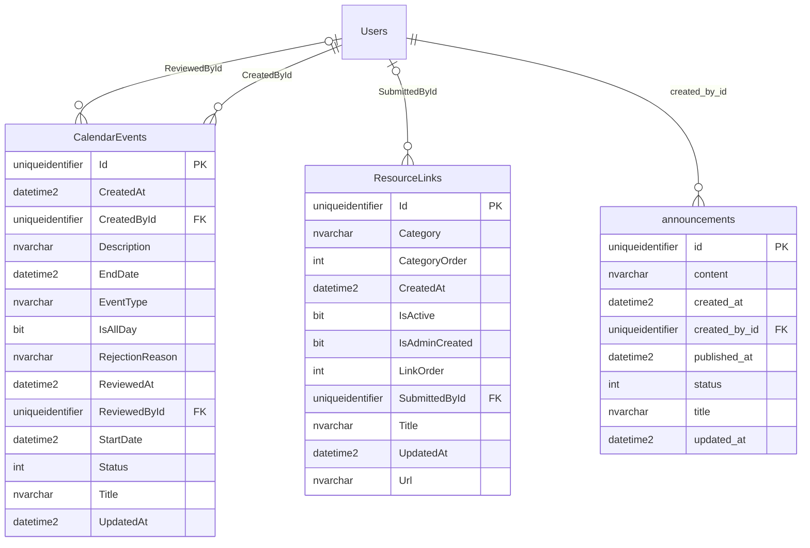
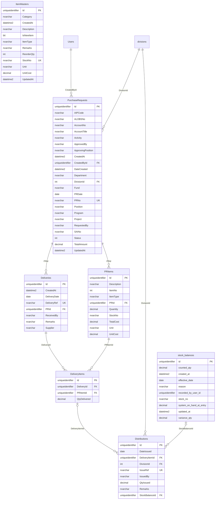
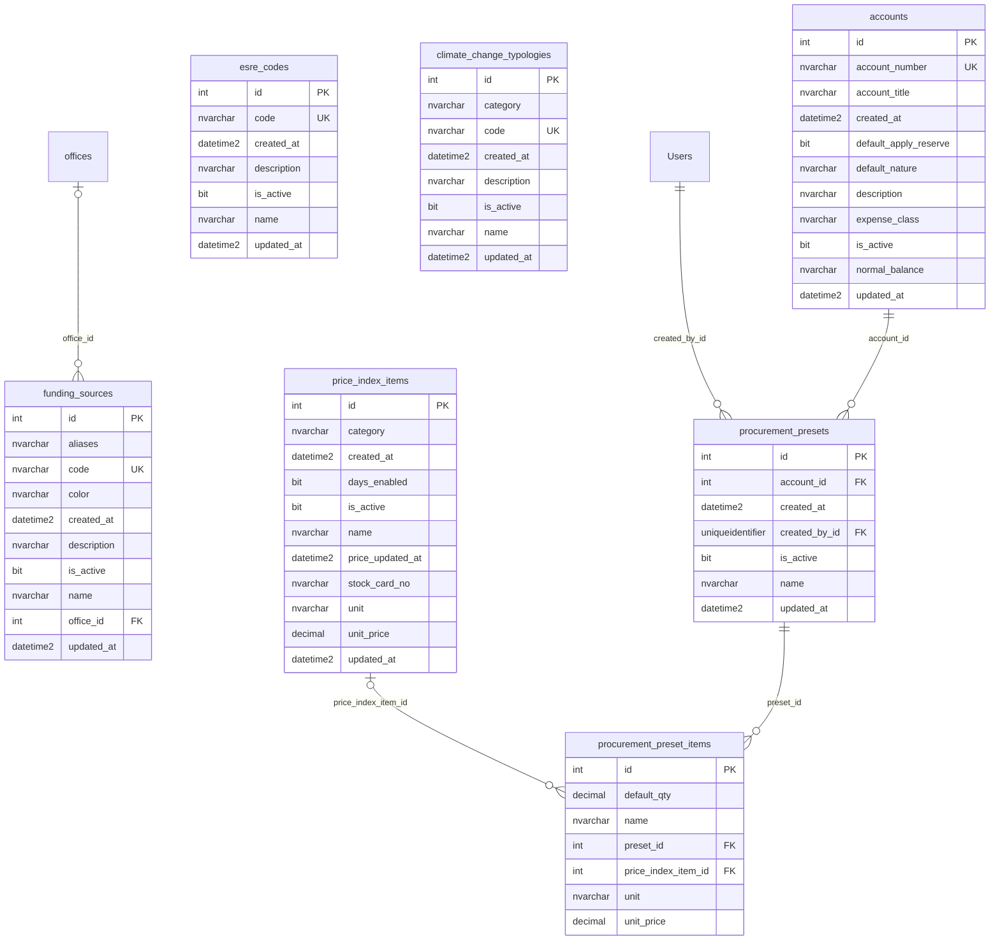
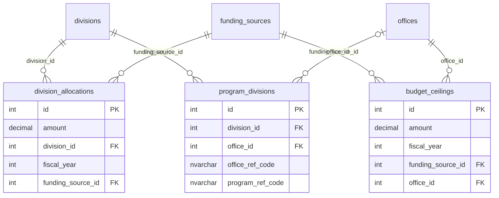
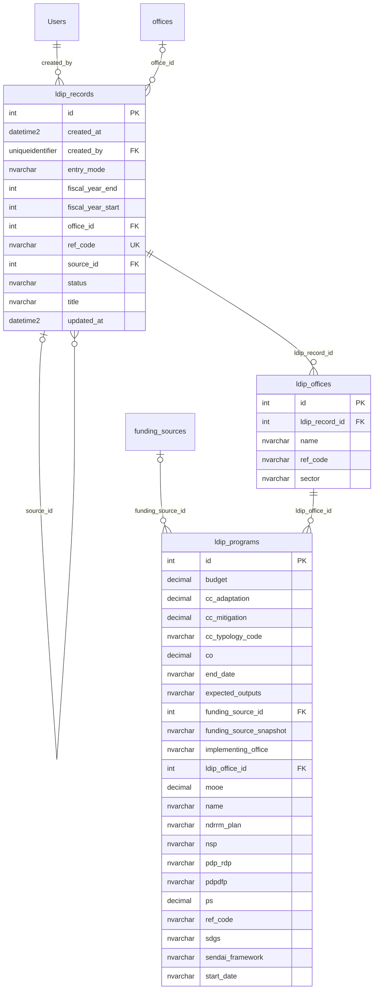
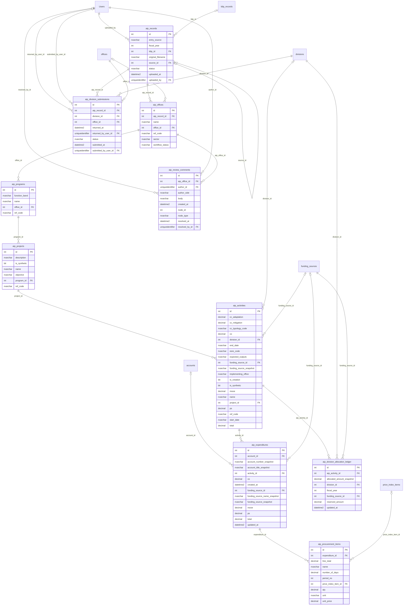
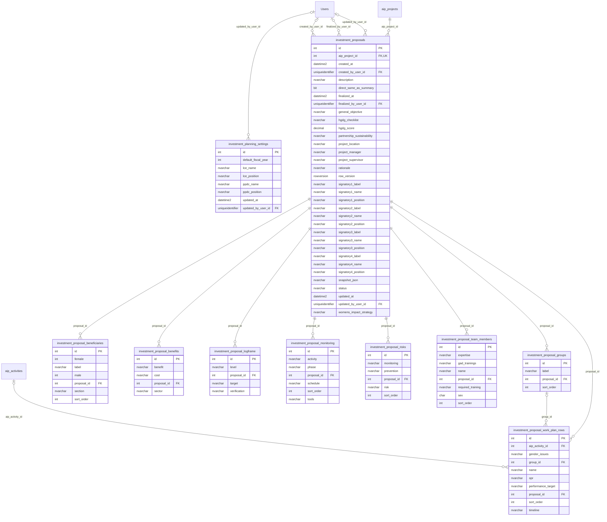
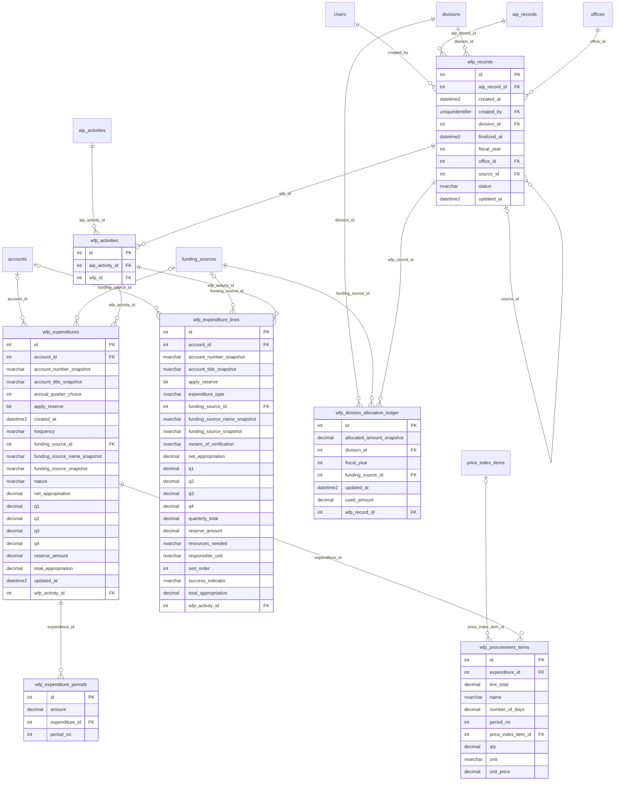

# PPDO Portal — Entity-Relationship Diagrams (v1.8.0)

> Generated by `scripts/generate_db_docs.py` from the EF Core model snapshot — **57 tables, 589 columns, 99 foreign keys**, 68 migrations, latest `20261001015710_AlignInvestmentProposalsWithTemplate`.
> Do not edit by hand: change the entity or its configuration, add a migration, and re-run the script.

Diagrams are Mermaid and render on GitHub and in VS Code (Markdown Preview Mermaid Support). Notation: `||` exactly one, `|o` zero or one, `o{` zero or many. Each relationship is labelled with the foreign-key column on the child table. In a module diagram, tables from other modules appear as a box with no columns.

## Contents

- [Overview — all tables](#overview)
- [Identity, Organization & Access](#erd-access)
- [Portal Content](#erd-portal)
- [Inventory & Procurement Monitoring](#erd-inventory)
- [Budget Reference Data](#erd-reference)
- [Ceilings & Allocation](#erd-allocation)
- [LDIP (Local Development Investment Program)](#erd-ldip)
- [AIP (Annual Investment Program) — v1.8.0 redesign](#erd-aip)
- [Investment Proposals — v1.8.0](#erd-proposal)
- [WFP (Work and Financial Plan)](#erd-wfp)

## Overview — all tables

Relationships only, no columns. Use the module diagrams below for detail.

```mermaid
erDiagram
    ItemMasters
    climate_change_typologies
    esre_codes
    Deliveries ||--o{ DeliveryItems : ""
    DeliveryItems ||--o{ Distributions : ""
    PRItems ||--o{ DeliveryItems : ""
    PurchaseRequests ||--o{ Deliveries : ""
    PurchaseRequests ||--o{ PRItems : ""
    Users ||--o{ CalendarEvents : ""
    Users ||--o{ PurchaseRequests : ""
    Users ||--o{ ResourceLinks : ""
    Users ||--o{ aip_division_submissions : ""
    Users ||--o{ aip_records : ""
    Users ||--o{ aip_review_comments : ""
    Users ||--o{ announcements : ""
    Users ||--o{ audit_log : ""
    Users ||--o{ investment_planning_settings : ""
    Users ||--o{ investment_proposals : ""
    Users ||--o{ ldip_records : ""
    Users ||--o{ partner_api_keys : ""
    Users ||--o{ procurement_presets : ""
    Users ||--o{ wfp_records : ""
    accounts ||--o{ aip_expenditures : ""
    accounts ||--o{ procurement_presets : ""
    accounts ||--o{ wfp_expenditure_lines : ""
    accounts ||--o{ wfp_expenditures : ""
    aip_activities ||--o{ aip_division_allocation_ledger : ""
    aip_activities ||--o{ aip_expenditures : ""
    aip_activities ||--o{ investment_proposal_work_plan_rows : ""
    aip_activities ||--o{ wfp_activities : ""
    aip_expenditures ||--o{ aip_procurement_items : ""
    aip_offices ||--o{ aip_programs : ""
    aip_offices ||--o{ aip_review_comments : ""
    aip_programs ||--o{ aip_projects : ""
    aip_projects ||--o{ aip_activities : ""
    aip_projects ||--o{ investment_proposals : ""
    aip_records ||--o{ aip_division_submissions : ""
    aip_records ||--o{ aip_offices : ""
    aip_records ||--o{ aip_records : ""
    aip_records ||--o{ wfp_records : ""
    divisions ||--o{ Distributions : ""
    divisions ||--o{ PurchaseRequests : ""
    divisions ||--o{ Users : ""
    divisions ||--o{ aip_activities : ""
    divisions ||--o{ aip_division_allocation_ledger : ""
    divisions ||--o{ aip_division_submissions : ""
    divisions ||--o{ division_allocations : ""
    divisions ||--o{ program_divisions : ""
    divisions ||--o{ wfp_division_allocation_ledger : ""
    divisions ||--o{ wfp_records : ""
    funding_sources ||--o{ aip_activities : ""
    funding_sources ||--o{ aip_division_allocation_ledger : ""
    funding_sources ||--o{ aip_expenditures : ""
    funding_sources ||--o{ budget_ceilings : ""
    funding_sources ||--o{ division_allocations : ""
    funding_sources ||--o{ ldip_programs : ""
    funding_sources ||--o{ wfp_division_allocation_ledger : ""
    funding_sources ||--o{ wfp_expenditure_lines : ""
    funding_sources ||--o{ wfp_expenditures : ""
    investment_proposal_groups ||--o{ investment_proposal_work_plan_rows : ""
    investment_proposals ||--o{ investment_proposal_beneficiaries : ""
    investment_proposals ||--o{ investment_proposal_benefits : ""
    investment_proposals ||--o{ investment_proposal_groups : ""
    investment_proposals ||--o{ investment_proposal_logframe : ""
    investment_proposals ||--o{ investment_proposal_monitoring : ""
    investment_proposals ||--o{ investment_proposal_risks : ""
    investment_proposals ||--o{ investment_proposal_team_members : ""
    investment_proposals ||--o{ investment_proposal_work_plan_rows : ""
    ldip_offices ||--o{ ldip_programs : ""
    ldip_records ||--o{ aip_records : ""
    ldip_records ||--o{ ldip_offices : ""
    ldip_records ||--o{ ldip_records : ""
    offices ||--o{ Users : ""
    offices ||--o{ aip_division_submissions : ""
    offices ||--o{ aip_offices : ""
    offices ||--o{ budget_ceilings : ""
    offices ||--o{ divisions : ""
    offices ||--o{ funding_sources : ""
    offices ||--o{ ldip_records : ""
    offices ||--o{ partner_api_key_offices : ""
    offices ||--o{ program_divisions : ""
    offices ||--o{ wfp_records : ""
    partner_api_keys ||--o{ partner_api_key_offices : ""
    partner_api_keys ||--o{ partner_api_requests : ""
    price_index_items ||--o{ aip_procurement_items : ""
    price_index_items ||--o{ procurement_preset_items : ""
    price_index_items ||--o{ wfp_procurement_items : ""
    procurement_presets ||--o{ procurement_preset_items : ""
    stock_balances ||--o{ Distributions : ""
    wfp_activities ||--o{ wfp_expenditure_lines : ""
    wfp_activities ||--o{ wfp_expenditures : ""
    wfp_expenditures ||--o{ wfp_expenditure_periods : ""
    wfp_expenditures ||--o{ wfp_procurement_items : ""
    wfp_records ||--o{ wfp_activities : ""
    wfp_records ||--o{ wfp_division_allocation_ledger : ""
    wfp_records ||--o{ wfp_records : ""
```

## Identity, Organization & Access

Users, the configurable office and division structure that scopes every query, the audit trail, and the partner keys that guard the external AIP API.

```mermaid
erDiagram
    Users {
        uniqueidentifier Id PK
        nvarchar ContactNo
        datetime2 CreatedAt
        int DivisionId FK
        nvarchar Email UK
        nvarchar FullName
        bit IsActive
        int LandingPage
        datetime2 LastPasswordResetAt
        bit MustChangePassword
        int OfficeId FK
        bit OverrideCanAccessBudgetPlanning
        bit OverrideCanAccessInventory
        bit OverrideCanAccessReports
        bit OverrideCanManageApiKeys
        bit OverrideCanManageConfig
        bit OverrideCanManagePboCeiling
        bit OverrideCanManageOfficeSetup
        bit OverrideCanManageAllocation
        bit OverrideCanManageResourceLinks
        bit OverrideCanManageUsers
        bit OverrideCanReviewAllOffices
        bit OverrideCanReviewBudgetPlanning
        bit OverrideCanUploadAip
        nvarchar PasswordHash
        datetime2 PasswordResetAcknowledgedAt
        nvarchar Position
        nvarchar RecoveryAnswerHash
        int RecoveryAttemptCount
        datetime2 RecoveryFirstAttemptAt
        int RecoveryQuestionKey
        nvarchar RefreshToken
        datetime2 RefreshTokenExpiry
        int Role
        datetime2 UpdatedAt
        nvarchar Username UK
    }
    offices {
        int id PK
        datetime2 created_at
        bit is_active
        bit is_host_office UK
        int landing_page
        nvarchar office_code UK
        nvarchar office_name
        nvarchar office_ref_code
        datetime2 updated_at
    }
    divisions {
        int id PK
        bit can_access_budget_planning
        bit can_access_inventory
        bit can_access_reports
        bit can_manage_config
        bit can_manage_resource_links
        bit can_manage_users
        bit can_upload_aip
        nvarchar code
        datetime2 created_at
        bit is_active
        int landing_page
        nvarchar name
        int office_id FK
        datetime2 updated_at
    }
    audit_log {
        bigint id PK
        nvarchar action
        datetime2 changed_at
        uniqueidentifier changed_by FK
        nvarchar new_values
        nvarchar old_values
        uniqueidentifier record_guid
        int record_id
        nvarchar table_name
    }
    partner_api_keys {
        int id PK
        bit all_offices
        datetime2 created_at
        uniqueidentifier created_by_id FK
        datetime2 expires_at
        nvarchar key_hash
        nvarchar key_prefix UK
        datetime2 last_used_at
        nvarchar partner_name
        datetime2 revoked_at
        uniqueidentifier revoked_by_id FK
    }
    partner_api_key_offices {
        int key_id PK,FK
        int office_id PK,FK
    }
    partner_api_requests {
        bigint id PK
        int fiscal_year
        int key_id FK
        nvarchar office_code
        datetime2 requested_at
        nvarchar route
        int status_code
    }
    Users |o--o{ partner_api_keys : "revoked_by_id"
    Users ||--o{ audit_log : "changed_by"
    Users ||--o{ partner_api_keys : "created_by_id"
    divisions |o--o{ Users : "DivisionId"
    offices |o--o{ Users : "OfficeId"
    offices ||--o{ divisions : "office_id"
    offices ||--o{ partner_api_key_offices : "office_id"
    partner_api_keys ||--o{ partner_api_key_offices : "key_id"
    partner_api_keys ||--o{ partner_api_requests : "key_id"
```

## Portal Content

Public announcements, the calendar of activities, and the shared resource links.

## Inventory & Procurement Monitoring

Items master, purchase requests, deliveries, distributions and the physical-count ledger (v1.0 → v1.7). Most of these are the legacy PascalCase tables.

## Budget Reference Data

Chart of accounts, funding sources, price index, procurement presets, ESRE codes and climate-change typologies — shared lookups used by WFP and AIP entry.

## Ceilings & Allocation

Budget ceilings per fiscal year and funding source, their split across divisions, and the program-to-division assignment.

## LDIP (Local Development Investment Program)

The multi-year LDIP, per office and program.

## AIP (Annual Investment Program) — v1.8.0 redesign

One record per fiscal year → offices → programs → projects → activities. FY2028+ activities carry expenditure lines and procurement items; FY2027 and earlier keep money on the activity (clean fiscal-year break, no data migration).

## Investment Proposals — v1.8.0

Project proposals that feed the AIP, with their logframe, work plan, team, risks and monitoring plan, plus the investment-planning settings per fiscal year.

## WFP (Work and Financial Plan)

Per-division WFP: activities, expenditures by frequency period, line items, procurement items, and the allocation ledger that tracks consumption against division allocations.

